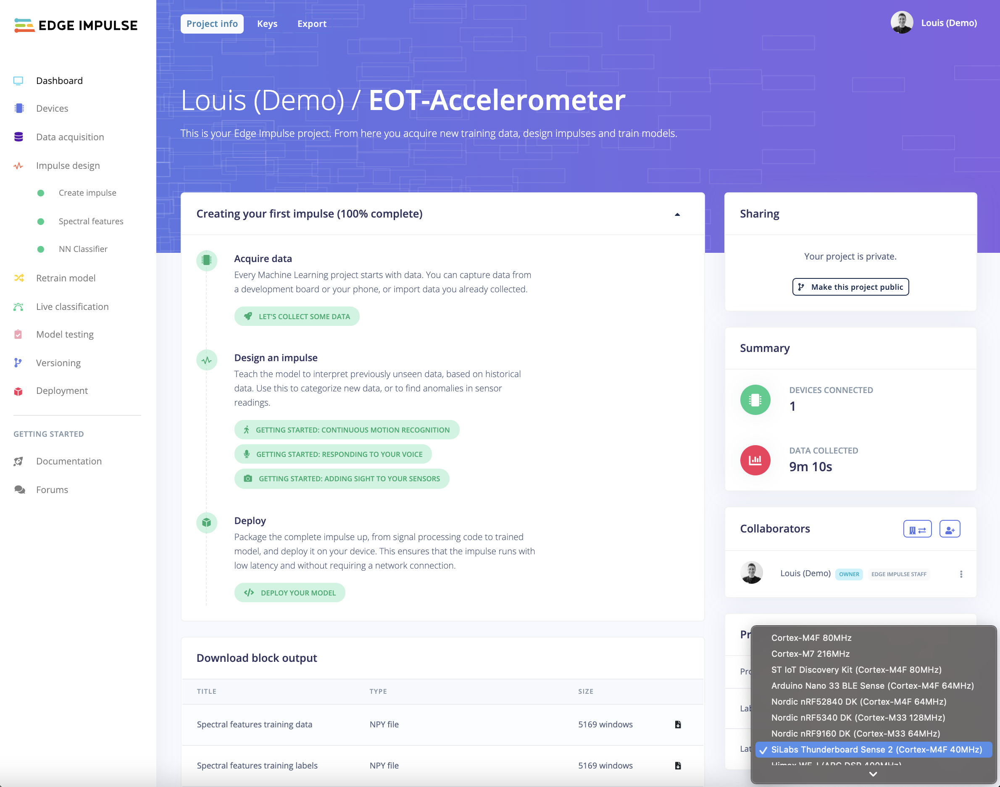

# Example SiLabs Thunderboard Sense 2

This example has been designed for the [EOT - Electronic of Tomorrow 2021](https://www.eot.dk/besoeg/workshops) workshops.

* **Duration:** 2.5 hours
* **Difficulty:** Intermediate
* **Objectives:** Build your first TinyML application by collecting data from real sensor, setting your machine learning pipeline in the cloud, validating your model and deploying it back to your device.

## Workshop Agenda

1. Setup local environment
2. **Project 1: Movement classification using a 3-axis accelerometer**
 * Flash default Edge Impulse firmware
 * Collect data
 * Create an Impulse
 * Preprocess your data using Spectral Analysis
 * Train your machine learning model using Neural Networks
 * Validate your model 
 * Deploy your model
3. **Project 2: Keyword Spotting using a microphone**

## Hardware overview:

The Silicon Labs Thunderboard Sense 2 is a complete development board with a Cortex-M4 microcontroller, a wide variety of sensors, a microphone, Bluetooth Low Energy and a battery holder - and it's fully supported by Edge Impulse. You'll be able to sample raw data, build models, and deploy trained machine learning models directly from the studio - and even stream your machine learning results over BLE to a phone. It's available for around 20 USD directly from [Silicon Labs](https://docs.edgeimpulse.com/docs/silabs-thunderboard-sense-2).

Thunderboard Sense 2 User's Guide: [Download PDF](https://www.silabs.com/documents/public/user-guides/ug309-sltb004a-user-guide.pdf)

## Requirements

### Hardware

* [SiLabs Thunderboard Sense 2](https://www.silabs.com/development-tools/thunderboard/thunderboard-sense-two-kit) development board.

### Software & tools

* [Edge Impulse Studio](https://studio.edgeimpulse.com/)
* [Edge Impulse CLI](https://docs.edgeimpulse.com/docs/cli-installation)
* [Docker](https://docs.docker.com/get-docker/) (optional but much easier to build the firmware)

If you don't want to use Docker, you can go to the [setup your local environment](#setup-your-local-environment-if-not-using-docker) section to install:

* [Simplicity Studio 5](https://www.silabs.com/developers/simplicity-studio).
* [Python 3.6.8](https://www.python.org/downloads/release/python-368/) (make sure your Python version exactly match this version).
* [Java 64 bit JVM 11](https://docs.aws.amazon.com/corretto/latest/corretto-11-ug/downloads-list.html) or higher.

## Project 1: Movement classification using a 3-axis accelerometer

In this project we will try to classify 5 kind of movements sampled at 100Hz: 

* `Circle`, drawing circles in the air with the board.
* `Square`, drawing rectangles in the air with the board.
* `Idle`, board sits idly on your desk.
* `Hold`, board is held in your hand, very close but slightly different from `idle` because of your breath movement for example. We will see later that it will be hard to classify `hold` vs `idle` correctly.
* `Unknown`, moving the board randomly.

Feel free to classify other kind of movements, such as `updown`, `snake`, `wave` in this [tutorial](https://docs.edgeimpulse.com/docs/continuous-gestures) or `squats`, `jumping jacks` and `rest` in this [tutorial](https://github.com/edgeimpulse/example-SparkFun-MicroMod-nRF52840).

### 1) Flash default Edge Impulse firmware

#### Connect the development board to your computer

Use a micro-USB cable to connect the development board to your computer. The development board should mount as a USB mass-storage device (like a USB flash drive), with the name TB004. Make sure you can see this drive.

#### Update the firmware

The development board does not come with the right firmware yet. To update the firmware:

1. [Download the latest Edge Impulse firmware](https://cdn.edgeimpulse.com/firmware/silabs-thunderboard-sense2.bin).
2. Drag the silabs-thunderboard-sense2.bin file to the TB004 drive.
3. Wait 30 seconds, your board's led will switch on, change colors and switch off.

*If dragging and dropping Edge Impulse .bin file results FAIL.TXT, to fix this error, install the [Simplicity Studio 5 IDE](#simplicity-studio) and flash the binary through the IDE's built in "Upload application..." menu under "Debug Adapters", and select your Edge Impulse firmware to flash:*

### 2) Collect data

If you do not have an Edge Impulse account yet, start by creating an account on [Edge Impulse Studio](https://studio.edgeimpulse.com) and create a project.

On this new project, select the `SiLabs Thunderboard Sense 2` board so the latency and performance estimations will calculated for your microcontroller:

To start collecting some data, go to the `Data acquisition` view and click on the `Connect using WebUSB` button on the upper right corner:

Collect your samples in the **Training data** tab. In this reference project, we collected 7m 30s equally split between 5 classes. You can set the `label`, the `frequency` and the `sample length` directly from the form on the right of the page: 

Do not forget to add some samples in the **Test data** tab. We usually use around 80% of the samples for the training set and 20% in the test set. Here we collected 20 seconds for each class in the test set:

The samples in the **Test data** won't be used during the training phase. We will use them later to validate the accuracy of our model.

Once you are happy with your data collection, you can move on to the next section where we will design our impulse.

### 3) Create an Impulse

With the training set in place you can design your impulse. An impulse takes the raw data, slices it up in smaller windows, uses signal processing blocks to extract features, and then uses a learning block to classify new data. Signal processing blocks always return the same values for the same input and are used to make raw data easier to process, while learning blocks learn from past experiences.

For this tutorial we'll use the `Spectral analysis` signal processing block. This block applies a filter, performs spectral analysis on the signal, and extracts frequency and spectral power data. Then we'll use a `Neural Network` learning block, that takes these spectral features and learns to distinguish between the four (idle, snake, wave, updown) classes.

In the studio go to `Create impulse`, set the window size to `2000` (you can click on the 2000 ms. text to enter an exact value), the window increase to `80`, and add the `Spectral Analysis` and `Classification (Keras)` blocks. Then click `Save Impulse`.

### 4) Preprocess your data using Spectral Analysis

Navigate to the `Spectral analysis` page. You can leave the default parameters for now and come back later to this page to modify the parameters if you are not happy with your results. I also invite you to read our documentation on the [Spectral Analysis](https://docs.edgeimpulse.com/docs/spectral-features) processing block if you want to understand all the parameters.

Click on `Save parameters` at the bottom of the page. You will arrive on the `Generate feature` view. Click on `Generate features` button as on the picture below:

What is interesting to observe in the 3D visualisation is the ability to quickly detect some clusters in the samples. Here, the `idle` and `hold` classes are very close. This will certainly lead to some confusion in our Neural Network classification. We will see this in the next section.

You can play with the DSP parameters and regenerate your features to see if you can obtain a better speration of your samples according to their classes. In our case, we will leave the default parameters.

### 5) Train your machine learning model using Neural Networks

To train your machine learning model using neural networks, go to the `NN Classifier` page. 

**Keep in mind that working on a machine learning project is an iterative process, to obtain better results, you can add more data, train longer, adjust the DSP parameters, change your neural network architecture or hyper parameters.** You can check the [increasing model performances](https://docs.edgeimpulse.com/docs/increasing-model-performance) section on our documentation website. 

We will see several iterations we did for this project so you can better understand the process we have been following:

#### Version 1:

For the first version, leave the default parameters and click on `Start training`. Based on the data of this project and the previous parameters. We obtained a 77.1% of accuracy:

As expected, when looking at the confusion matrix, we clearly see that the difficulty is to classify correctly `idle` and `hold`.

It is usually a good idea to verify the accuracy on samples that were unknown to the model during the training phase. To do so, under the `Model testing` page and click on `Classify all`. If you see a significant difference between the training accuracy and the testing accuracy, it usually means that your model was underfitting or overfitting:

From now, we have several options to make the model better. 
Save the version of this model by clicking on `#1` and `Clone as new primary version`:

#### Version 2:

The next step will be to add another layer to our model architecture. Click on `Add an extra layer` and choose a `Dense` layer of 10 neurons.

Train again your model, in this project, the accuracy won almost 20%!

And for the model testing:

#### Version 3:

For the third version, we trained longer (90 epochs), decreased the learning rate to `0.0003`, added a dropout layer to avoid overfitting. We obtained a 97.1% accuracy:

We will stop here but if you want to get an even better model, the next step would be to add some more data in your training set.

### 6) Deploy your model

To deploy the model, you can either download the binary firmware from the studio or build the firwmare from the generated C++ libraries on your local machine. I strongly encourage you to test the second option as it will let you build custom applications in the future that can exactly match your needs. 

We will show you the two ways.

#### Download and flash the ready-to-go firmware:

## Setup your local environment (if not using Docker)

### Simplicity Studio

Download Simplicity Studio from this link: [Simplicity Studio 5](https://www.silabs.com/developers/simplicity-studio).

Use the provided installer to install it on your local machine.

Once installed, you should see the following view:

Accept the agreements and create an account:

Click on install in the menu and click on `Install by connecting device(s)`:

Connect your SiLabs Thunderboard Sense 2 board to your computer using a micro usb:

Now use the default parameters to install the required SDKs and dependencies. This step can take up to 15 minutes depending on your internet connection. Once finish, you will need to restart Simplicity Studio 5:

